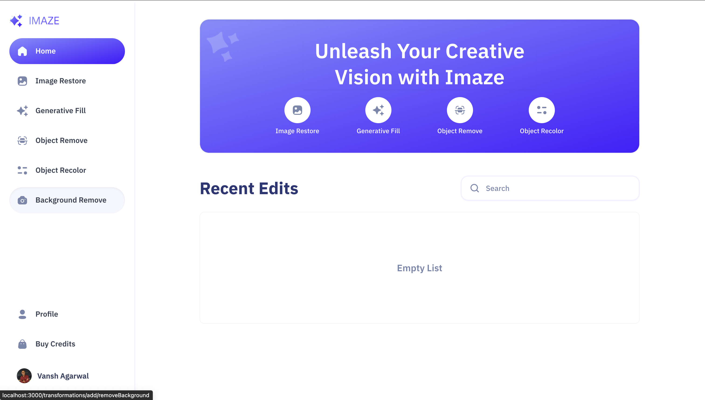

# AI Image Editor SaaS Platform

## Features
- Intriguing & Responsive UI/UX
- User Signin/signup via Google/github
- AI Image Restoration
- Generative Fill 
- AI Object Removal 
- Object Recoloring
- Background Removal
- View Profile Page & update settings 
- Upgrade to premium features (Buy credits)

 <br/>


## Built With
- Next JS
- Cloudinary 
- TypeScript 
- Clerk Auth 
- Svix 
- Stripe
- Tailwind CSS


## Usage

Navigate following commands in your terminal 

```bash
git clone https://github.com/vansh2308/IMAZE-ai-image-editor.git
cd ./IMAZE-ai-image-editor
npm i 
```

Create a file .env.local in root & provide the env varibles
```env 
#NEXT
NEXT_PUBLIC_SERVER_URL=

#MONGODB
MONGODB_URL=

#CLERK
NEXT_PUBLIC_CLERK_PUBLISHABLE_KEY=
CLERK_SECRET_KEY=
WEBHOOK_SECRET=

NEXT_PUBLIC_CLERK_SIGN_IN_URL=/sign-in
NEXT_PUBLIC_CLERK_SIGN_UP_URL=/sign-up
NEXT_PUBLIC_CLERK_AFTER_SIGN_IN_URL=/
NEXT_PUBLIC_CLERK_AFTER_SIGN_UP_URL=/

#CLOUDINARY
NEXT_PUBLIC_CLOUDINARY_CLOUD_NAME=
CLOUDINARY_API_KEY=
CLOUDINARY_API_SECRET=

#STRIPE
STRIPE_SECRET_KEY=
STRIPE_WEBHOOK_SECRET=
NEXT_PUBLIC_STRIPE_PUBLISHABLE_KEY=
```

Open terminal & execute:
```
npm run dev
```

Now type http://localhost:3000 in your browser. Bingo!!

## Author

- Github - [vansh2308](https://github.com/vansh2308)
- Website - [Vansh Agarwal](https://portfolio-website-self-xi.vercel.app/)
- Frontend Mentor - [@vansh2308](https://www.frontendmentor.io/profile/vansh2308)